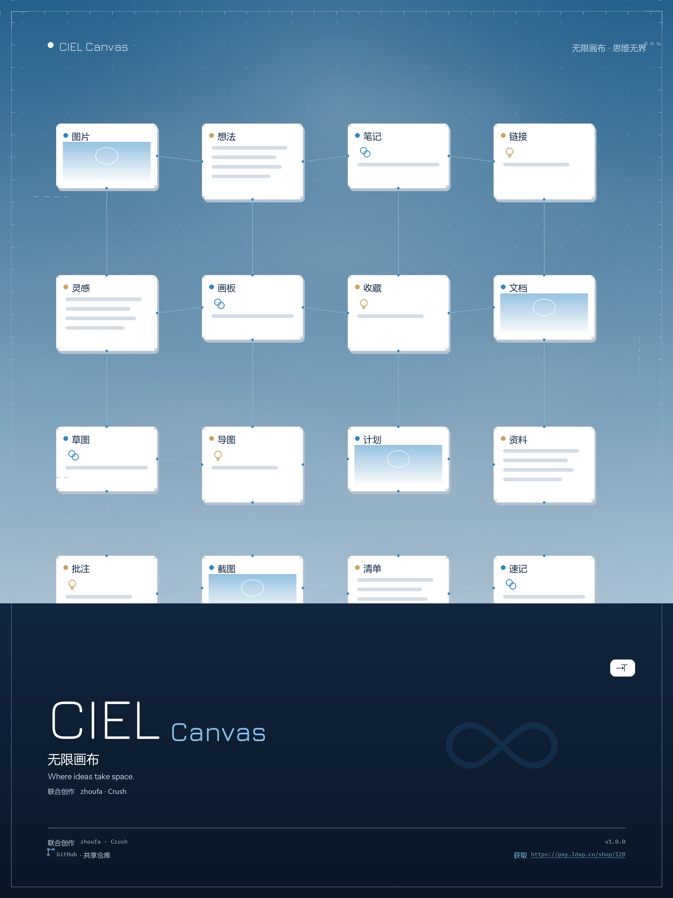

# CIEL Canvas

CIEL Canvas（CIEL 无限画布）是基于 [Infinite-Canvas](https://github.com/hero8152/Infinite-Canvas) 修改和迭代的非商业源码公开版，当前版本为 **1.0.0**。



## 下载

请从 [v1.0.0 Release](https://github.com/zhoufa128-oss/CIEL-Canvas/releases/tag/v1.0.0) 下载：

- **Windows x64 Portable**：解压后可直接运行，当前 Windows EXE 未进行代码签名，SmartScreen 可能要求人工确认。
- **macOS Apple Silicon BuildKit**：这是在 Apple Silicon Mac 上执行构建的工具包，不是已经构建好的 `.app`。需要 macOS 11 或更高版本、Python 3.11–3.14 和 Xcode Command Line Tools。

下载后请按照 Release 页面提供的 `SHA256SUMS.txt` 校验文件完整性。

## 主要内容

- 无限画布和图片节点交互
- 本地 Web UI、工作流和 Provider 配置
- Windows x64 Portable 发行包
- macOS arm64 构建脚本和验证工具
- 本地 UserData 数据隔离、备份与诊断工具

## Windows 使用

1. 解压 Windows Portable 包到可写目录。
2. 启动 CIEL Canvas，首次启动后按界面提示配置 API。
3. 用户数据、配置、日志和导出内容保存在运行目录的 `UserData/` 中；不要将该目录提交到 Git。

## macOS 构建

macOS 构建必须在真实 Apple Silicon Mac 上完成：

```zsh
cd CIEL_Canvas_1.0.0_macOS_arm64_BuildKit
python3 Build/build_macos_arm64_release.py --self-check
python3 Build/build_macos_arm64_release.py
```

详见 [`Docs/macOS_AppleSilicon_构建说明.md`](Docs/macOS_AppleSilicon_构建说明.md)。Windows 只能完成静态检查，不能生成可运行的 Mach-O 应用。

## API 配置与数据

API 密钥必须由使用者自行配置。仓库只保留空值示例和公开 Provider 地址，不包含任何真实密钥。请勿提交 `.env`、`UserData/`、日志、缓存、上传内容或诊断输出。

## 来源、修改与许可证

- 原始项目：Infinite-Canvas
- 上游仓库：`hero8152/Infinite-Canvas`
- 当前项目：CIEL Canvas
- CIEL Canvas 是基于原始项目进行修改和功能迭代的版本，不将原始代码声称为全部由 CIEL 独立创作。
- 必须完整遵守随项目保留的 [`LICENSE`](LICENSE)，不得将本项目宣称为 MIT、Apache、GPL、BSD 或可自由商用软件。
- 本版本为非商业用途版本；商业封装、销售或其他商业使用须取得相应授权。基于本代码的二次开发应继续公开源码并注明来源。

完整说明见 [`SOURCE_AND_ATTRIBUTION.md`](SOURCE_AND_ATTRIBUTION.md) 和 [`THIRD_PARTY_NOTICES.md`](THIRD_PARTY_NOTICES.md)。

## 反馈

请在 GitHub Issues 中提供可复现步骤、系统版本和脱敏后的日志。不要上传 API 密钥、个人数据、UserData、诊断包或其他私密文件。
